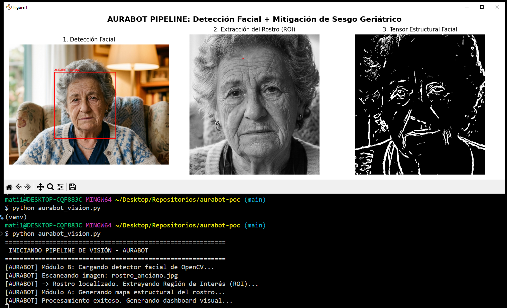

# AURABOT: Core PoC (Proof of Concept)

Repositorio de validación algorítmica y técnica en etapa **TRL 2-3** para el proyecto **AURABOT (Deep Tech)** - Pontificia Universidad Católica de Valparaíso (PUCV).

## Objetivo de la Prueba de Concepto
Esta simulación en Python valida empíricamente la viabilidad de la **Sección 8.1 del informe técnico**: *Mitigación Matemática del Sesgo Geriátrico*.

Los modelos tradicionales de IA presentan altos índices de falsos positivos al analizar pieles envejecidas (confunden arrugas naturales con micro-expresiones de dolor o heridas). Este *pipeline* demuestra cómo la arquitectura de AURABOT aplica un **Aislamiento Funcional por Gradientes de Textura** para limpiar el ruido visual antes de enviar los tensores a la red neuronal principal de *Affective Computing*.

## Arquitectura del Pipeline Analítico
El script `aurabot_vision.py` ejecuta el siguiente flujo de procesamiento en cascada:

1. **Detección Facial Estructurada:** Uso de clasificadores *Haar Cascade* de OpenCV con ecualización de histograma para localizar y aislar el rostro del residente, extrayendo la Región de Interés (ROI) precisa.
2. **Filtro Bilateral Geriátrico:** Aplicación de un filtro no lineal (preservador de bordes) que suaviza los pliegues finos de la piel envejecida, pero mantiene intacta la estructura geométrica de los músculos faciales.
3. **Derivadas Espaciales (Sobel):** Computación de gradientes espaciales (X e Y) para mapear topográficamente el rostro y destacar exclusivamente los puntos de tensión reales.
4. **Umbralización Estructural:** Generación de un tensor limpio (máscara binaria al 25%), libre de ruido visual y sesgo demográfico, optimizado para la inferencia de emociones.

## Evidencia de Ejecución Local
*Demostración empírica del aislamiento de gradientes.*


*(Nota: Por motivos de Privacidad por Diseño y normativas de protección de datos médicos, el repositorio no incluye imágenes de pacientes reales, utilizando imágenes de stock para la validación TRL 2-3).*

## Cómo ejecutar la simulación en local

1. Clona este repositorio en tu máquina local.
2. Instala las dependencias necesarias mediante pip:
   ```bash
   pip install -r requirements.txt
   ```
3. Agrega una imagen de prueba en la raíz del proyecto nombrada estrictamente como `rostro_anciano.jpg` (se recomienda un rostro frontal con iluminación clara).
4. Ejecuta el motor de visión:
   ```bash
   python aurabot_vision.py
   ```